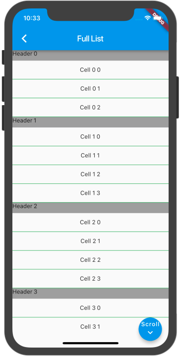
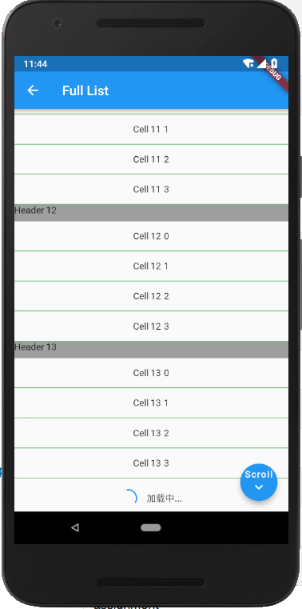

# flutter_section_table_view

- A iOS like table view including section, row, section header and divider
- you can animate/jump to specific index path
- you can know which index path it scrolled to, when scrolling


## Usage

#### first(optional)
init Section Table Controller, so that you can scroll table view by index path

and you can pass a callback function to get scrolled position when scrolling
```dart
  final controller = SectionTableController(sectionTableViewScrollTo: (section, row, isScrollDown) {
    print('received scroll to $section $row scrollDown:$isScrollDown');
  });
```
#### second
render SectionTableView
```dart
SectionTableView(
          sectionCount: 7,
          numOfRowInSection: (section) {
            return section == 0 ? 3 : 4;
          },
          cellAtIndexPath: (section, row) {
            return Container(
              height: 44.0,
              child: Center(
                child: Text('Cell $section $row'),
              ),
            );
          },
          headerInSection: (section) {
            return Container(
              height: 25.0,
              color: Colors.grey,
              child: Text('Header $section'),
            );
          },
          divider: Container(
            color: Colors.green,
            height: 1.0,
          ),
          controller: controller, //SectionTableController
          sectionHeaderHeight: (section) => 25.0,
          dividerHeight: () => 1.0,
          cellHeightAtIndexPath: (section, row) => 44.0,
        )
```


#### third
if you want, you can animate/jump to specific indexPath by calling
```dart
controller.animateTo(2, -1).then((complete) {
              print('animated $complete');
```


| iOS | android |
| --- | ------- |
|  | |


## Getting Started

For help getting started with Flutter, view our online [documentation](https://flutter.io/).

For help on editing package code, view the [documentation](https://flutter.io/developing-packages/).
